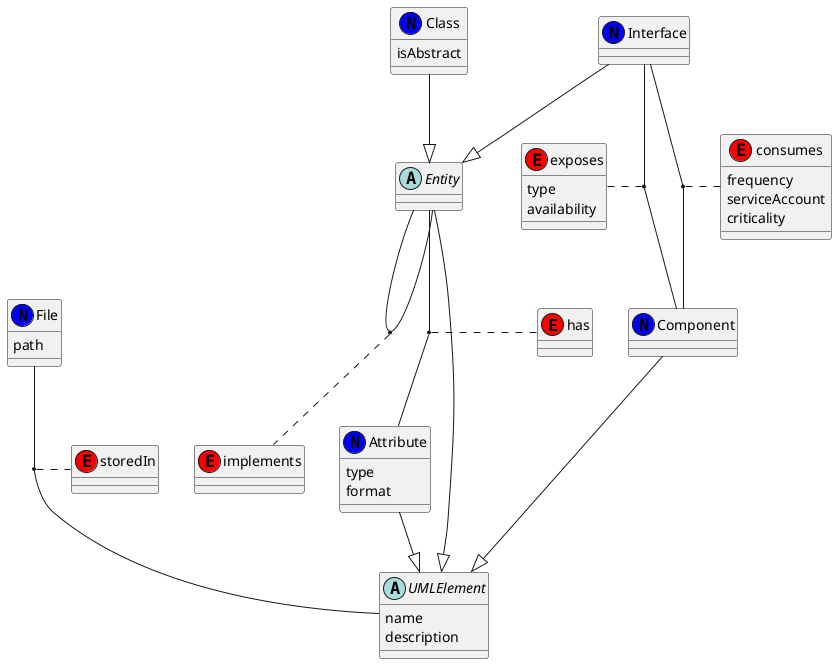

# Formatters

# Graph

```plantuml
@startuml
class has << (E,#FF0000) >> {
}
class storedIn << (E,#FF0000) >> {
}
class implements << (E,#FF0000) >> {
}
class exposes << (E,#FF0000) >> {
  type
  availability
}
class consumes << (E,#FF0000) >> {
  frequency
  serviceAccount
  criticality
}

abstract class UMLElement {
  name
  description
}

abstract class Entity {
}
Entity --|> UMLElement
Entity -- Entity
(Entity, Entity) .. implements
Entity -- Attribute
(Entity, Attribute) .. has

class Class << (N,#0000FF) >> {
  isAbstract
}
Class --|> Entity

class Interface << (N,#0000FF) >> {
}
Interface --|> Entity
Interface -- Component
(Interface, Component) .. exposes
Interface -- Component
(Interface, Component) .. consumes

class Attribute << (N,#0000FF) >> {
  type
  format
}
Attribute --|> UMLElement

class File << (N,#0000FF) >> {
  path
}
File -- UMLElement
(File, UMLElement) .. storedIn

class Component << (N,#0000FF) >> {
}
Component --|> UMLElement
@enduml
```
